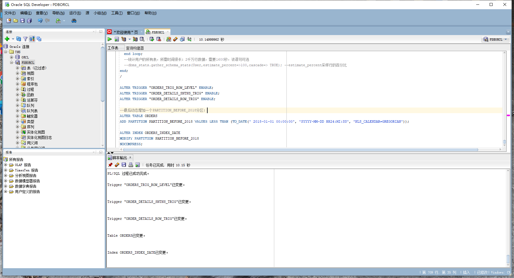
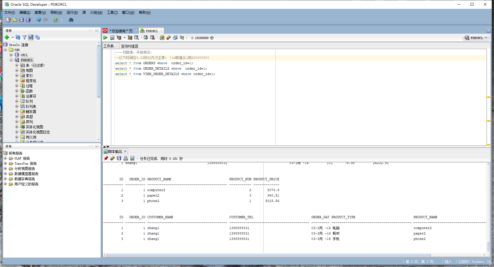
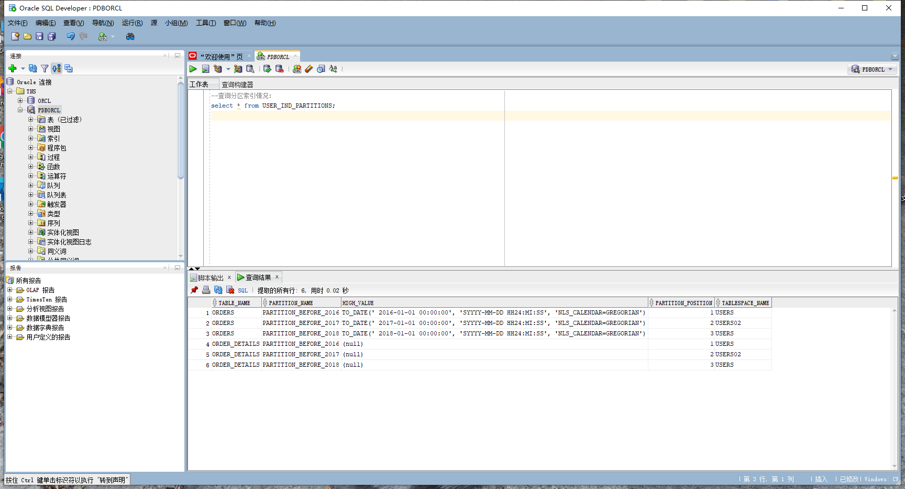
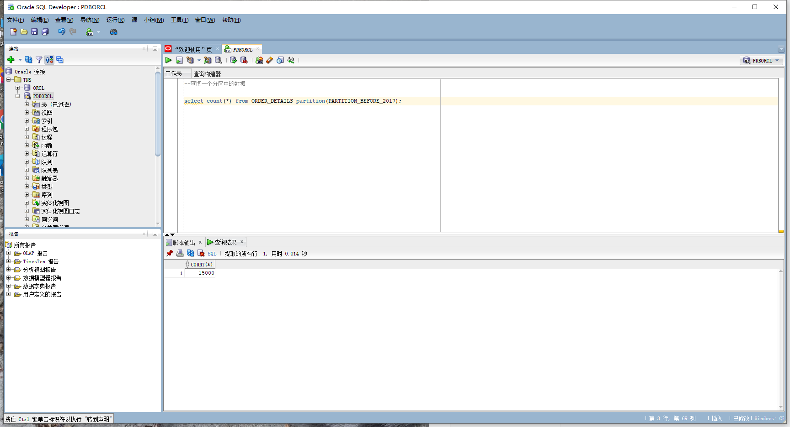
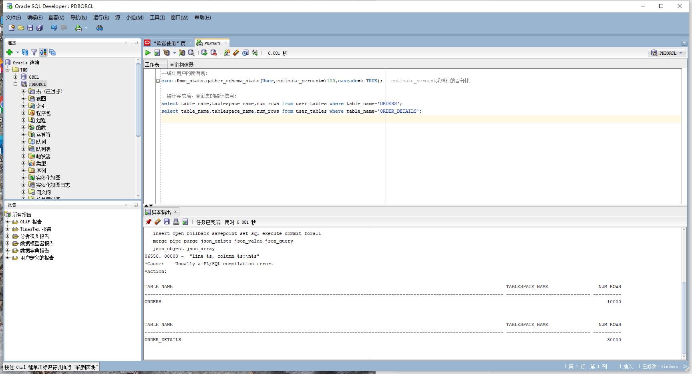
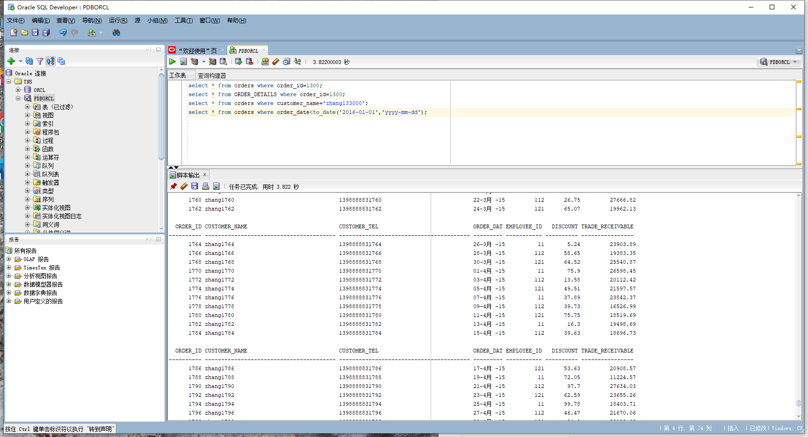
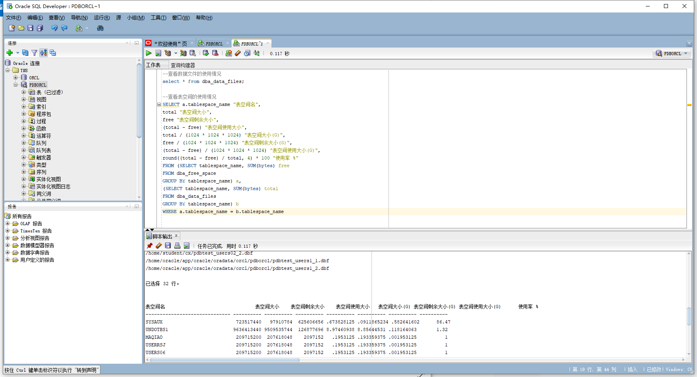
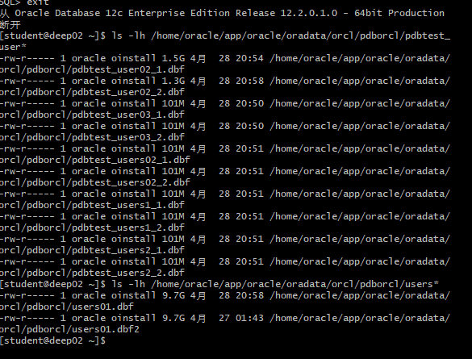
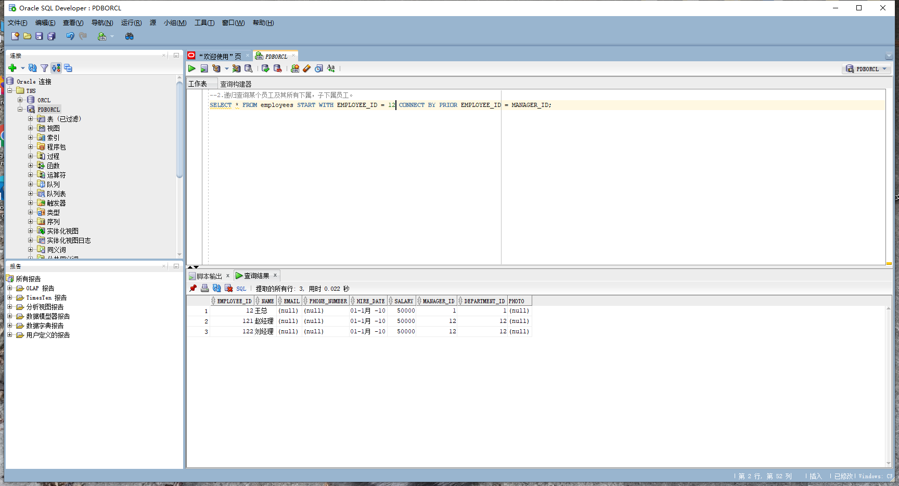

# 实验4：对象管理
## 姓名：王澳航，学号：201810414421
## 实验目的：
了解Oracle表和视图的概念，学习使用SQL语句Create Table创建表，学习Select语句插入，修改，删除以及查询数据，学习使用SQL语句创建视图，学习部分存储过程和触发器的使用。
## - 实验场景：
假设有一个生产某个产品的单位，单位接受网上订单进行产品的销售。通过实验模拟这个单位的部分信息：员工表，部门表，订单表，订单详单表。
## 实验内容：
1.以system身份登录并创建new_wah角色并授权：

```下面是创建用户new_wah
CREATE USER new_wah IDENTIFIED BY 123
DEFAULT TABLESPACE "USERS"
TEMPORARY TABLESPACE "TEMP";
-- QUOTAS
ALTER USER new_wah QUOTA UNLIMITED ON USERS;
ALTER USER new_wah QUOTA UNLIMITED ON USERS02;
ALTER USER new_wah ACCOUNT UNLOCK;
-- ROLES
GRANT "CONNECT" TO new_wah WITH ADMIN OPTION;
GRANT "RESOURCE" TO new_wah WITH ADMIN OPTION;
ALTER USER new_wah DEFAULT ROLE "CONNECT","RESOURCE";
-- SYSTEM PRIVILEGES
GRANT CREATE VIEW TO new_wah WITH ADMIN OPTION;
```
2.退出登录，查看脚本文件test4.sql: 
```sql
    cat test4.sql
```

3.用自己的用户new_wah登录,并运行脚本文件 test4.sql: 
```sql
    sqlplus new_wah/123@localhost/pdborcl
    @test4.sql
```

## 测试代码：
```
一切就绪，开始测试：
以下时间在0.02秒以内才正常：（id取值从1到20000000）
select * from ORDERS where  order_id=1;
select * from ORDER_DETAILS where  order_id=1;
select * from VIEW_ORDER_DETAILS where order_id=1;
--2.递归查询某个员工及其所有下属，子下属员工。
WITH A (EMPLOYEE_ID,NAME,EMAIL,PHONE_NUMBER,HIRE_DATE,SALARY,MANAGER_ID,DEPARTMENT_ID) AS
  (SELECT EMPLOYEE_ID,NAME,EMAIL,PHONE_NUMBER,HIRE_DATE,SALARY,MANAGER_ID,DEPARTMENT_ID
    FROM employees WHERE employee_ID = 11
    UNION ALL
  SELECT B.EMPLOYEE_ID,B.NAME,B.EMAIL,B.PHONE_NUMBER,B.HIRE_DATE,B.SALARY,B.MANAGER_ID,B.DEPARTMENT_ID
    FROM A, employees B WHERE A.EMPLOYEE_ID = B.MANAGER_ID)
SELECT * FROM A;
--或者
SELECT * FROM employees START WITH EMPLOYEE_ID = 11 CONNECT BY PRIOR EMPLOYEE_ID = MANAGER_ID;
--特殊查询语句：
--查询分区表情况:
select TABLE_NAME,PARTITION_NAME,HIGH_VALUE,PARTITION_POSITION,TABLESPACE_NAME from user_tab_partitions
--查询分区索引情况：
select * from USER_IND_PARTITIONS;
--查询一个分区中的数据
select count(*) from ORDERS partition(PARTITION_BEFORE_2016);
select count(*) from ORDERS partition(PARTITION_BEFORE_2017);
--或者：
--select count(*) from ORDERS where order_date<to_date('2016-01-01','yyyy-mm-dd');
select count(*) from ORDER_DETAILS partition(PARTITION_BEFORE_2016);
select count(*) from ORDER_DETAILS partition(PARTITION_BEFORE_2017);
--收集表的统计信息dbms_stats.gather_table_stats
--也可以使用ANALYZE TABLE TableName COMPUTE STATISTICS; 但推荐使用dbms_stats.gather_table_stats
--分析单个表：
--exec dbms_stats.gather_table_stats(user,'ORDERS',cascade=>true); --cascade=true表示同时收集索引的信息
--exec dbms_stats.gather_table_stats(user,'ORDER_DETAILS',cascade=>true);
--统计用户的所有表：
exec dbms_stats.gather_schema_stats(User,estimate_percent=>100,cascade=> TRUE); --estimate_percent采样行的百分比
--统计完成后，查询表的统计信息：
select table_name,tablespace_name,num_rows from user_tables where table_name='ORDERS';
select table_name,tablespace_name,num_rows from user_tables where table_name='ORDER_DETAILS';
select * from orders where order_id=1300;
select * from ORDER_DETAILS where order_id=1300;
select * from orders where customer_name='zhang133000';
select * from orders where order_date<to_date('2016-01-01','yyyy-mm-dd');
--查看数据文件的使用情况
select * from dba_data_files;
--查看表空间的使用情况
SELECT a.tablespace_name "表空间名",
total "表空间大小",
free "表空间剩余大小",
(total - free) "表空间使用大小",
total / (1024 * 1024 * 1024) "表空间大小(G)",
free / (1024 * 1024 * 1024) "表空间剩余大小(G)",
(total - free) / (1024 * 1024 * 1024) "表空间使用大小(G)",
round((total - free) / total, 4) * 100 "使用率 %"
FROM (SELECT tablespace_name, SUM(bytes) free
FROM dba_free_space
GROUP BY tablespace_name) a,
(SELECT tablespace_name, SUM(bytes) total
FROM dba_data_files
GROUP BY tablespace_name) b
WHERE a.tablespace_name = b.tablespace_name
--查看数据文件大小:
[oracle@cdh3 ~]$ ls -lh /home/oracle/app/oracle/oradata/orcl/pdbtest/pdbtest_users*
-rw-r----- 1 oracle root 3.8G 11月  1 14:53 /home/oracle/app/oracle/oradata/orcl/pdbtest/pdbtest_users01_2.dbf
-rw-r----- 1 oracle root 2.4G 11月  1 14:53 /home/oracle/app/oracle/oradata/orcl/pdbtest/pdbtest_users01.dbf
-rw-r----- 1 oracle root 1.5G 11月  1 14:53 /home/oracle/app/oracle/oradata/orcl/pdbtest/pdbtest_users02_1.dbf
-rw-r----- 1 oracle root 2.5G 11月  1 14:53 /home/oracle/app/oracle/oradata/orcl/pdbtest/pdbtest_users02_2.dbf
```
## 查寻表：
1.开始测试，查询员工：

2.查询分区情况和分区索引情况：

3.查询一个分区的数据：

4.统计用户的所有表并查询统计信息：






5.表空间使用：


6.查看数据文件的大小：




7.递归查询某个员工及其所有下属子员工：


## 实验总结
经过本次实验，我学习到了解Oracle表和视图的概念，学习使用SQL语句Create Table创建表，学习Select语句插入，修改，删除以及查询数据，学习使用SQL语句创建视图，学习部分存储过程和触发器的使用。实验不难，只要跟着老师的调子走，就能顺利完成。
